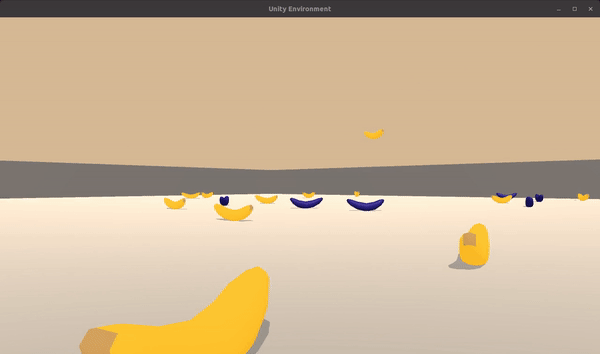

# Banana Agent

---
For this project, I trained an agent to navigate (and collect bananas!) in a large, square world.  

A reward of +1 is provided for collecting a yellow banana, and a reward of -1 is provided for collecting a blue banana.  Thus, the goal of the agent is to collect as many yellow bananas as possible while avoiding blue bananas.  

The state space has 37 dimensions and contains the agent's velocity, along with ray-based perception of objects around agent's forward direction.  Given this information, the agent has to learn how to best select actions.  Four discrete actions are available, corresponding to:
- **`0`** - move forward.
- **`1`** - move backward.
- **`2`** - turn left.
- **`3`** - turn right.

The task is episodic, and in order to solve the environment, the agent must get an average score of +13 over 100 consecutive episodes.

---

## Dependencies

To set up your python environment to run the code in this repository, follow the instructions below.

1. Create (and activate) a new environment with Python 3.6.

	- __Linux__ or __Mac__:
	```bash
	conda create --name drlnd python=3.6
	source activate drlnd
	```
	- __Windows__:
	```bash
	conda create --name drlnd python=3.6
	activate drlnd
	```

2. Clone the repository (if you haven't already!), and navigate to the `python/` folder.  Then, install several dependencies.
```bash
git clone https://github.com/moritztng/banana-agent.git
cd banana-agent/python
pip install .
```

3. Download the Unity Environment
Download the Unity Environment from one of the links below. You need only select the environment that matches your operating system:
- Linux: [Linux](https://s3-us-west-1.amazonaws.com/udacity-drlnd/P1/Banana/Banana_Linux.zip)
- Mac OSX: [Mac](https://s3-us-west-1.amazonaws.com/udacity-drlnd/P1/Banana/Banana.app.zip)
- Windows(32 Bit):[W32](https://s3-us-west-1.amazonaws.com/udacity-drlnd/P1/Banana/Banana_Windows_x86.zip)
- Windows(64 Bit): [W64](https://s3-us-west-1.amazonaws.com/udacity-drlnd/P1/Banana/Banana_Windows_x86_64.zip)

Then, place the file in the `p1_navigation/` folder in the GitHub repository, and unzip (or decompress) the file.

## Training

I framed the problem as a Markov Decision Process. Hence, I was able to solve it with Reinforcement Learning. In particular I used Double-Q-Learning with dueling network architectures. I trained the agent in a Unity Environment with a Jupyter Notebook `p1_navigation\Train.ipynb`. You are not able to execute the Notebook, since I used it in a different environment. However, you can review all of my code and all of the outputs. For more details take a look at [report](report.md).

## Testing
You are able to test the agent with the trained weigths by executing `p1_navigation\test.py`.
You can change the number of `Episodes` with the following command:
```bash
python test.py --episodes 5
```

## Acknowledgement
This project was part of the Udacity Reinforcement Learning Nanodegree. Without their resources the project would not exist.
